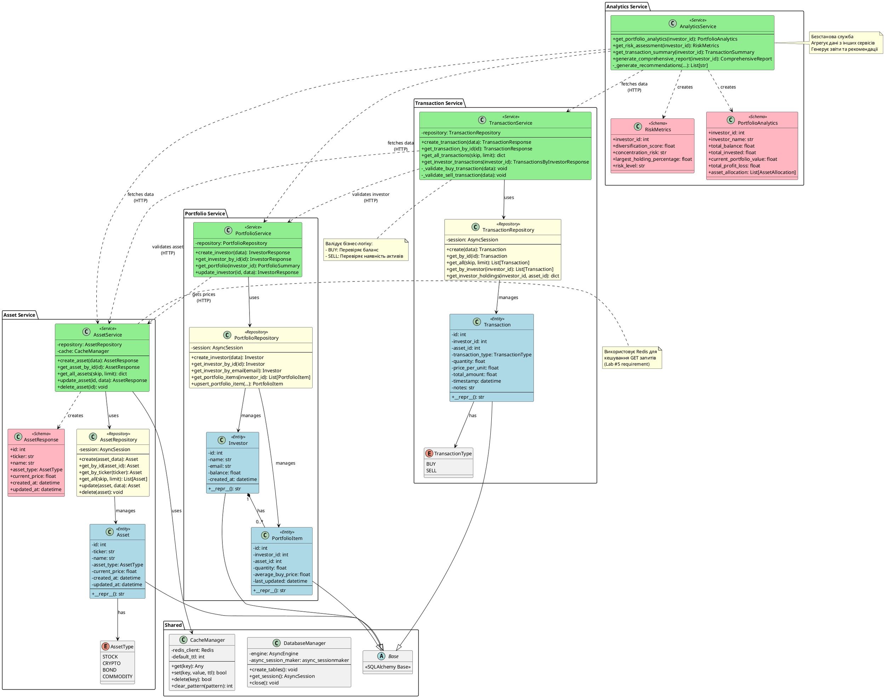

# UML-діаграма класів

## PlantUML код

Скопіюйте код нижче в [PlantUML Online Editor](https://www.plantuml.com/plantuml/uml/) або використайте VS Code з розширенням PlantUML.



## Як використовувати

### Варіант 1: Online Editor
1. Відкрийте [PlantUML Online Editor](https://www.plantuml.com/plantuml/uml/)
2. Вставте код вище
3. Натисніть "Submit" або Ctrl+S
4. Збережіть діаграму як PNG або SVG

### Варіант 2: VS Code
1. Встановіть розширення "PlantUML" від jebbs
2. Створіть файл `class-diagram.puml`
3. Вставте код вище
4. Натисніть `Alt+D` для попереднього перегляду
5. Експортуйте в форматі: SVG, PNG, або PDF

### Варіант 3: Command Line (потрібен Java)
```bash
# Завантажте plantuml.jar
# Збережіть код у файл class-diagram.puml

java -jar plantuml.jar class-diagram.puml
```

## Опис діаграми

Діаграма показує:

1. **Asset Service**:
   - Entity: Asset з типом AssetType
   - Repository для доступу до даних
   - Service з бізнес-логікою та кешуванням
   - Schema для API відповідей

2. **Portfolio Service**:
   - Entity: Investor та PortfolioItem
   - Зв'язок один-до-багатьох між інвесторами та позиціями
   - Repository та Service шари

3. **Transaction Service**:
   - Entity: Transaction з типом TransactionType
   - Валідація бізнес-логіки (покупка/продаж)
   - Repository та Service шари

4. **Analytics Service**:
   - Безстанова служба
   - Агрегує дані з інших сервісів через HTTP
   - Генерує аналітику та рекомендації

5. **Shared Components**:
   - CacheManager для Redis
   - DatabaseManager для PostgreSQL
   - Base клас для всіх моделей

## Основні патерни

- **Layered Architecture**: Router → Service → Repository → Database
- **Repository Pattern**: Відокремлення логіки доступу до даних
- **Microservices Communication**: HTTP REST між сервісами
- **Caching Pattern**: Redis в Asset Service

## Для звіту

Ця діаграма демонструє:
- ✅ Структуру класів в кожному мікросервісі
- ✅ Layered Architecture (розділення відповідальності)
- ✅ Міжсервісну взаємодію
- ✅ Використання кешування (Lab #5)
- ✅ Repository Pattern
- ✅ REST принципи
