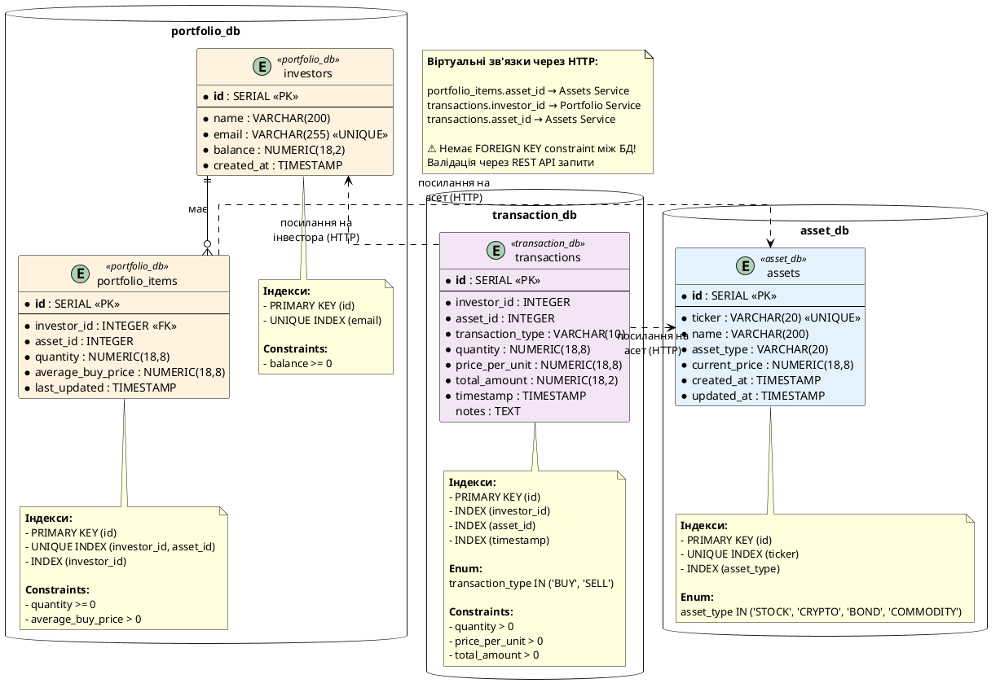

# ER-діаграма бази даних

## PlantUML код



## Як використовувати

Скопіюйте код у [PlantUML Online Editor](https://www.plantuml.com/plantuml/uml/) або використайте VS Code з розширенням PlantUML.

## Опис структури

### База даних 1: asset_db (Asset Service)

**Таблиця: assets**
- Зберігає інформацію про інвестиційні активи
- Первинний ключ: `id` (автоінкремент)
- Унікальний ключ: `ticker` (код активу, наприклад "BTC", "AAPL")
- Підтримувані типи: STOCK, CRYPTO, BOND, COMMODITY
- Ціна зберігається з точністю до 8 знаків

### База даних 2: portfolio_db (Portfolio Service)

**Таблиця: investors**
- Зберігає інформацію про інвесторів
- Первинний ключ: `id`
- Унікальний ключ: `email`
- `balance` - доступний баланс для покупки активів

**Таблиця: portfolio_items**
- Зберігає позиції портфеля інвестора
- Унікальна комбінація: (investor_id, asset_id)
- `quantity` - кількість одиниць активу
- `average_buy_price` - середня ціна покупки
- Foreign Key до `investors`

### База даних 3: transaction_db (Transaction Service)

**Таблиця: transactions**
- Зберігає всі транзакції покупки/продажу
- Первинний ключ: `id`
- Типи: BUY (покупка), SELL (продаж)
- `total_amount` = `quantity` × `price_per_unit`
- Індекси для швидкого пошуку за інвестором, активом, датою

## Особливості мікросервісної архітектури

### 🔴 Немає FOREIGN KEY між базами!

У монолітній архітектурі ми б мали:
```sql
ALTER TABLE transactions 
    ADD CONSTRAINT fk_investor 
    FOREIGN KEY (investor_id) REFERENCES investors(id);

ALTER TABLE transactions 
    ADD CONSTRAINT fk_asset 
    FOREIGN KEY (asset_id) REFERENCES assets(id);
```

**Але в мікросервісах:**
- Кожен сервіс має свою базу даних
- Немає прямих SQL зв'язків між базами
- Валідація через HTTP API запити
- Eventual consistency замість транзакційної цілісності

### Приклад валідації через HTTP

**Transaction Service перед створенням транзакції:**

```python
# Перевірка існування активу
asset_response = await httpx.get(f"http://asset-service:8001/assets/{asset_id}")
if asset_response.status_code == 404:
    raise ResourceNotFoundException("Asset not found")

# Перевірка балансу інвестора
investor_response = await httpx.get(f"http://portfolio-service:8003/investors/{investor_id}")
if investor_response.status_code == 404:
    raise ResourceNotFoundException("Investor not found")
```

## SQL scripts для створення таблиць

### Asset Service (asset_db)

```sql
CREATE TABLE assets (
    id SERIAL PRIMARY KEY,
    ticker VARCHAR(20) UNIQUE NOT NULL,
    name VARCHAR(200) NOT NULL,
    asset_type VARCHAR(20) NOT NULL CHECK (asset_type IN ('STOCK', 'CRYPTO', 'BOND', 'COMMODITY')),
    current_price NUMERIC(18,8) NOT NULL CHECK (current_price > 0),
    created_at TIMESTAMP DEFAULT CURRENT_TIMESTAMP,
    updated_at TIMESTAMP DEFAULT CURRENT_TIMESTAMP
);

CREATE INDEX idx_assets_type ON assets(asset_type);
```

### Portfolio Service (portfolio_db)

```sql
CREATE TABLE investors (
    id SERIAL PRIMARY KEY,
    name VARCHAR(200) NOT NULL,
    email VARCHAR(255) UNIQUE NOT NULL,
    balance NUMERIC(18,2) NOT NULL DEFAULT 0 CHECK (balance >= 0),
    created_at TIMESTAMP DEFAULT CURRENT_TIMESTAMP
);

CREATE TABLE portfolio_items (
    id SERIAL PRIMARY KEY,
    investor_id INTEGER NOT NULL REFERENCES investors(id) ON DELETE CASCADE,
    asset_id INTEGER NOT NULL,
    quantity NUMERIC(18,8) NOT NULL CHECK (quantity >= 0),
    average_buy_price NUMERIC(18,8) NOT NULL CHECK (average_buy_price > 0),
    last_updated TIMESTAMP DEFAULT CURRENT_TIMESTAMP,
    UNIQUE(investor_id, asset_id)
);

CREATE INDEX idx_portfolio_investor ON portfolio_items(investor_id);
```

### Transaction Service (transaction_db)

```sql
CREATE TABLE transactions (
    id SERIAL PRIMARY KEY,
    investor_id INTEGER NOT NULL,
    asset_id INTEGER NOT NULL,
    transaction_type VARCHAR(10) NOT NULL CHECK (transaction_type IN ('BUY', 'SELL')),
    quantity NUMERIC(18,8) NOT NULL CHECK (quantity > 0),
    price_per_unit NUMERIC(18,8) NOT NULL CHECK (price_per_unit > 0),
    total_amount NUMERIC(18,2) NOT NULL CHECK (total_amount > 0),
    timestamp TIMESTAMP DEFAULT CURRENT_TIMESTAMP,
    notes TEXT
);

CREATE INDEX idx_transactions_investor ON transactions(investor_id);
CREATE INDEX idx_transactions_asset ON transactions(asset_id);
CREATE INDEX idx_transactions_timestamp ON transactions(timestamp);
```

## Для звіту

Ця діаграма демонструє:
- ✅ Структуру трьох незалежних баз даних
- ✅ Database per Service pattern (кожен мікросервіс має свою БД)
- ✅ Відсутність SQL FOREIGN KEY між сервісами
- ✅ Віртуальні зв'язки через REST API
- ✅ Індекси для оптимізації запитів
- ✅ Constraints для забезпечення цілісності в межах одного сервісу

## Еволюція від монолітної до мікросервісної архітектури

| Монолітна | Мікросервісна |
|-----------|---------------|
| Одна БД для всього | 3 окремі БД |
| SQL FOREIGN KEY | HTTP валідація |
| ACID транзакції | Eventual consistency |
| Швидкі JOIN запити | Повільні HTTP запити |
| Сильна зв'язність | Слабка зв'язність |
| Важко масштабувати | Легко масштабувати |
