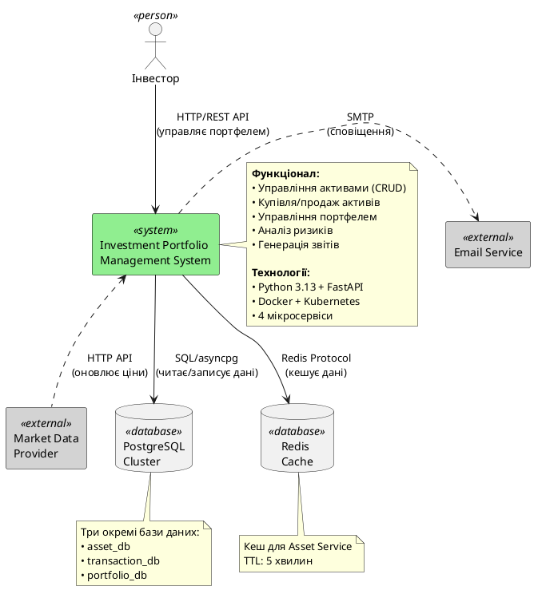

# Архітектурна схема взаємодії (C4 Context Level)

## PlantUML код

```plantuml
@startuml Investment Portfolio System Context

!include https://raw.githubusercontent.com/plantuml-stdlib/C4-PlantUML/master/C4_Context.puml

' Або якщо не працює include:
' LAYOUT_WITH_LEGEND()

title System Context для Investment Portfolio Management System

Person(investor, "Інвестор", "Користувач системи, який управляє своїм інвестиційним портфелем")

System(portfolio_system, "Investment Portfolio Management System", "Мікросервісна система для управління інвестиційним портфелем: купівля/продаж активів, аналіз ризиків, генерація звітів")

System_Ext(market_data, "Market Data Provider", "Зовнішній сервіс для отримання актуальних цін активів (опціонально)")

System_Ext(notification, "Email Service", "Зовнішній сервіс для відправки email сповіщень (опціонально)")

SystemDb(postgres, "PostgreSQL Cluster", "Реляційна база даних для зберігання даних про активи, інвесторів, транзакції")

SystemDb(redis, "Redis Cache", "Кеш для прискорення доступу до даних про активи")

Rel(investor, portfolio_system, "Управляє портфелем через", "HTTP/REST API")
Rel(portfolio_system, postgres, "Читає/записує дані", "SQL/asyncpg")
Rel(portfolio_system, redis, "Кешує дані активів", "Redis Protocol")
Rel_Back(market_data, portfolio_system, "Оновлює ціни активів", "HTTP API (опціонально)")
Rel(portfolio_system, notification, "Відправляє сповіщення", "SMTP (опціонально)")

note right of portfolio_system
  **Технології:**
  - Python 3.13
  - FastAPI Framework
  - Uvicorn ASGI Server
  - Docker Containers
  - Kubernetes Orchestration
  
  **Порти:**
  8001 - Asset Service
  8002 - Transaction Service
  8003 - Portfolio Service
  8004 - Analytics Service
end note

note right of postgres
  **Окремі бази:**
  - asset_db
  - transaction_db
  - portfolio_db
  
  Database per Service pattern
end note

@enduml
```

## Альтернативний код (без C4 Include)

Якщо C4 include не працює, використайте цей варіант:



## Як використовувати

### З C4 Model (рекомендовано)

1. Використайте [PlantUML Online Editor](https://www.plantuml.com/plantuml/uml/)
2. Переконайтеся, що редактор має доступ до інтернету для завантаження C4 бібліотеки
3. Вставте перший код
4. Експортуйте діаграму

### Без C4 Model

1. Використайте альтернативний код вище
2. Він працює без зовнішніх залежностей

### VS Code

1. Встановіть розширення "PlantUML"
2. Створіть файл `context-diagram.puml`
3. Вставте код
4. `Alt+D` для перегляду

## Опис компонентів

### Актори

**Інвестор** - кінцевий користувач системи:
- Переглядає доступні активи
- Купує та продає активи
- Перевіряє свій портфель
- Отримує аналітичні звіти

### Центральна система

**Investment Portfolio Management System**:
- Складається з 4 мікросервісів
- Обробляє HTTP/REST запити
- Забезпечує бізнес-логіку
- Координує роботу всіх компонентів

### Зовнішні системи

**Market Data Provider** (опціонально):
- Реальні дані про ціни активів
- Приклади: Yahoo Finance, CoinGecko API
- В нашій реалізації ціни вводяться вручну

**Email Service** (опціонально):
- Відправка сповіщень про транзакції
- Periodic portfolio reports
- В нашій реалізації не реалізовано

### Сховища даних

**PostgreSQL Cluster**:
- Три окремі бази даних
- Кожен мікросервіс має свою БД
- Database per Service pattern

**Redis Cache**:
- Кешування даних активів
- TTL: 300 секунд (5 хвилин)
- Використовується тільки Asset Service

## Use Cases

### Основні сценарії використання

1. **Перегляд активів**
   - Інвестор → Portfolio System → Redis (cache) → PostgreSQL (asset_db)
   - Відповідь: список активів з цінами

2. **Купівля активу**
   - Інвестор → Portfolio System
   - System перевіряє баланс інвестора
   - System перевіряє існування активу
   - System створює транзакцію
   - System оновлює портфель

3. **Аналіз портфеля**
   - Інвестор → Portfolio System
   - System агрегує дані з усіх сервісів
   - System розраховує метрики
   - System генерує рекомендації

## Нефункціональні вимоги

### Продуктивність
- Час відповіді API: < 500ms для 95% запитів
- Кеш зменшує час відповіді до < 50ms
- Підтримка до 1000 одночасних користувачів

### Масштабованість
- Горизонтальне масштабування через Kubernetes
- Кожен сервіс може мати 2+ реплік
- Load balancing через Kubernetes Services

### Надійність
- Health checks кожні 10 секунд
- Automatic restart на failure
- Rolling updates без downtime

### Безпека
- Input validation через Pydantic
- SQL injection protection через SQLAlchemy ORM
- CORS configuration для frontend

## Deployment View

```
[Користувач] 
    ↓ HTTPS
[Load Balancer / Ingress]
    ↓ HTTP
[Kubernetes Cluster]
    ├── Asset Service (Port 8001)
    ├── Transaction Service (Port 8002)
    ├── Portfolio Service (Port 8003)
    └── Analytics Service (Port 8004)
    ↓
[PostgreSQL Cluster]
[Redis Cluster]
```

## Для звіту

Ця діаграма демонструє:
- ✅ System Context (C4 Level 1)
- ✅ Зовнішні інтеграції
- ✅ Актори системи
- ✅ Основні технології
- ✅ Сховища даних
- ✅ Протоколи взаємодії
- ✅ Deployment архітектура

## Порівняння з монолітом

| Аспект | Монолітна | Мікросервісна (наша) |
|--------|-----------|---------------------|
| Кількість процесів | 1 | 4 сервіси |
| База даних | 1 спільна | 3 окремі |
| Deployment | Все разом | Незалежно |
| Масштабування | Вертикальне | Горизонтальне |
| Technology stack | Єдиний | Можливі різні |
| Складність | Низька | Висока |
| Fault isolation | Ні | Так |
