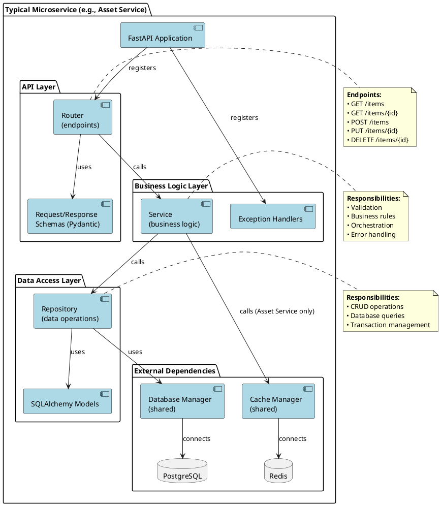
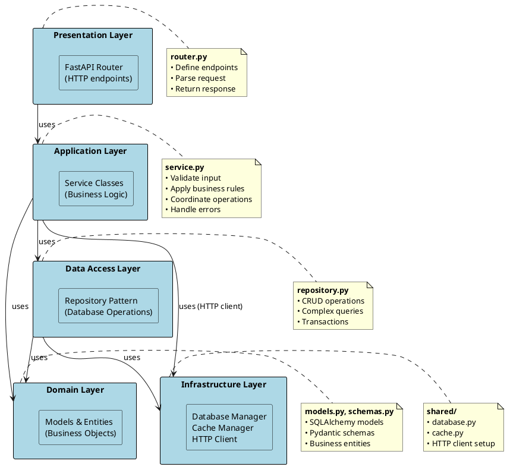

# Схема мікросервісної архітектури (Container Diagram)

## PlantUML код

```plantuml
@startuml Microservices Architecture

!define ICONURL https://raw.githubusercontent.com/tupadr3/plantuml-icon-font-sprites/v2.4.0
!include ICONURL/common.puml
!include ICONURL/font-awesome-5/user.puml
!include ICONURL/font-awesome-5/database.puml
!include ICONURL/font-awesome-5/server.puml

skinparam rectangle {
    BackgroundColor<<service>> LightGreen
    BackgroundColor<<database>> LightYellow
    BackgroundColor<<cache>> LightPink
    BackgroundColor<<external>> LightGray
    BorderColor Black
    FontSize 11
}

skinparam arrow {
    Color Black
    FontSize 10
}

title Мікросервісна архітектура Investment Portfolio Management System

actor "Інвестор" as user

package "API Gateway / Load Balancer" {
    rectangle "Kubernetes Ingress\n(опціонально)" as ingress <<external>>
}

package "Microservices Layer" {
    rectangle "Asset Service\n:8001" as asset_service <<service>> {
        component "FastAPI Router" as asset_router
        component "Asset Service Logic" as asset_logic
        component "Asset Repository" as asset_repo
        component "Cache Manager" as cache_mgr
    }
    
    rectangle "Transaction Service\n:8002" as tx_service <<service>> {
        component "FastAPI Router" as tx_router
        component "Transaction Service Logic" as tx_logic
        component "Transaction Repository" as tx_repo
    }
    
    rectangle "Portfolio Service\n:8003" as portfolio_service <<service>> {
        component "FastAPI Router" as portfolio_router
        component "Portfolio Service Logic" as portfolio_logic
        component "Portfolio Repository" as portfolio_repo
    }
    
    rectangle "Analytics Service\n:8004" as analytics_service <<service>> {
        component "FastAPI Router" as analytics_router
        component "Analytics Service Logic" as analytics_logic
        note right: Stateless\nNo database
    }
}

package "Data Layer" {
    database "PostgreSQL\nasset_db" as asset_db <<database>>
    database "PostgreSQL\ntransaction_db" as tx_db <<database>>
    database "PostgreSQL\nportfolio_db" as portfolio_db <<database>>
    database "Redis Cache" as redis <<cache>>
}

' User interactions
user --> ingress : HTTP/REST
ingress --> asset_service
ingress --> tx_service
ingress --> portfolio_service
ingress --> analytics_service

' Asset Service internal
asset_router --> asset_logic
asset_logic --> asset_repo
asset_logic --> cache_mgr
asset_repo --> asset_db : asyncpg
cache_mgr --> redis : redis-py

' Transaction Service internal
tx_router --> tx_logic
tx_logic --> tx_repo
tx_repo --> tx_db : asyncpg

' Portfolio Service internal
portfolio_router --> portfolio_logic
portfolio_logic --> portfolio_repo
portfolio_repo --> portfolio_db : asyncpg

' Analytics Service internal
analytics_router --> analytics_logic

' Inter-service communication (HTTP)
tx_logic ..> asset_service : "GET /assets/{id}\nvalidate asset" : HTTP
tx_logic ..> portfolio_service : "GET /investors/{id}\ncheck balance" : HTTP
portfolio_logic ..> asset_service : "GET /assets/{id}\nget current price" : HTTP
analytics_logic ..> asset_service : "GET /assets\nfetch all assets" : HTTP
analytics_logic ..> portfolio_service : "GET /investors/{id}\nget portfolio" : HTTP
analytics_logic ..> tx_service : "GET /transactions\nget history" : HTTP

note right of asset_service
  **Відповідальність:**
  • CRUD активів
  • Кешування (Redis)
  • Надання даних про ціни
  
  **Технології:**
  • FastAPI + Uvicorn
  • SQLAlchemy async
  • Redis client
  
  **Database:** asset_db
end note

note right of tx_service
  **Відповідальність:**
  • Створення транзакцій
  • Валідація BUY/SELL
  • Історія операцій
  
  **Бізнес-логіка:**
  • BUY: check balance
  • SELL: check holdings
  • Update portfolio
  
  **Database:** transaction_db
end note

note right of portfolio_service
  **Відповідальність:**
  • Управління інвесторами
  • Портфельні позиції
  • Розрахунок P&L
  
  **Операції:**
  • Create/Update investor
  • Get portfolio summary
  • Update holdings
  
  **Database:** portfolio_db
end note

note right of analytics_service
  **Відповідальність:**
  • Агрегація даних
  • Розрахунок метрик
  • Генерація звітів
  • Рекомендації
  
  **Особливості:**
  • Stateless service
  • No own database
  • Calls all other services
  
  **Database:** NONE
end note

note bottom of redis
  **Конфігурація:**
  • Default TTL: 300s
  • Cache keys: "asset:{id}"
  • Only Asset Service uses
  
  **Cache Strategy:**
  • Cache-Aside pattern
  • Write-through updates
end note

note bottom of asset_db
  **Tables:**
  • assets
  
  **Size:** ~100-1000 records
  **Access pattern:** Read-heavy
end note

note bottom of tx_db
  **Tables:**
  • transactions
  
  **Size:** Growing (append-only)
  **Access pattern:** Write-heavy
end note

note bottom of portfolio_db
  **Tables:**
  • investors
  • portfolio_items
  
  **Size:** ~100s of investors
  **Access pattern:** Read/Write balanced
end note

@enduml
```

## Діаграма внутрішньої структури сервісу



## Layered Architecture Pattern



## Як використовувати

1. Скопіюйте код в [PlantUML Online Editor](https://www.plantuml.com/plantuml/uml/)
2. Або використайте VS Code + PlantUML extension
3. Експортуйте в PNG/SVG

## Опис архітектури

### 🎯 Microservices Layer

Кожен мікросервіс має:

**Asset Service** (Port 8001)
- Управління активами (CRUD)
- Кешування через Redis
- Надання даних про ціни іншим сервісам
- Database: asset_db

**Transaction Service** (Port 8002)
- Обробка купівлі/продажу
- Валідація через HTTP запити до Asset та Portfolio Services
- Запис історії транзакцій
- Database: transaction_db

**Portfolio Service** (Port 8003)
- Управління інвесторами
- Портфельні позиції
- Розрахунок прибутку/збитку
- Database: portfolio_db

**Analytics Service** (Port 8004)
- Агрегація даних з усіх сервісів
- Розрахунок аналітичних метрик
- Генерація звітів та рекомендацій
- Database: НЕМАЄ (stateless)

### 🗄️ Data Layer

**PostgreSQL Cluster**
- Три окремі бази даних
- Кожен сервіс має повний контроль над своєю БД
- Database per Service pattern

**Redis Cache**
- Використовується тільки Asset Service
- TTL: 5 хвилин
- Cache-Aside pattern

### 🔄 Communication Patterns

**Synchronous REST**
- Transaction → Asset Service (validate)
- Transaction → Portfolio Service (check balance)
- Portfolio → Asset Service (get prices)
- Analytics → All Services (aggregate data)

**Asynchronous** (не реалізовано, але можливо)
- Message queue (RabbitMQ, Kafka)
- Event-driven architecture
- Pub/Sub pattern

## Design Patterns

### 1. Repository Pattern
```python
class AssetRepository:
    async def get_by_id(self, id: int) -> Asset:
        # Data access logic
```

### 2. Service Layer Pattern
```python
class AssetService:
    async def get_asset_by_id(self, id: int) -> AssetResponse:
        # Business logic
        # Cache logic
```

### 3. Database per Service
- Кожен сервіс має окрему БД
- Незалежне масштабування
- Loose coupling

### 4. Cache-Aside
```python
# Try cache first
cached = await cache.get(key)
if cached:
    return cached

# Cache miss - fetch from DB
data = await repository.get_by_id(id)
await cache.set(key, data)
return data
```

### 5. API Gateway (опціонально)
- Single entry point
- Routing
- Load balancing
- Authentication (можливо додати)

## Комунікація між сервісами

### Example Flow: Create Transaction (BUY)

```
1. User → Transaction Service: POST /transactions
2. Transaction Service → Asset Service: GET /assets/{id}
   └─ Validate asset exists
3. Transaction Service → Portfolio Service: GET /investors/{id}
   └─ Check balance sufficient
4. Transaction Service → Database: INSERT transaction
5. Transaction Service → Portfolio Service: POST /portfolio/update
   └─ Update holdings
6. Transaction Service → User: 201 Created
```

### Example Flow: Get Portfolio Report

```
1. User → Analytics Service: GET /analytics/report/{investor_id}
2. Analytics Service → Portfolio Service: GET /investors/{id}
   └─ Get investor data
3. Analytics Service → Portfolio Service: GET /portfolio/{id}
   └─ Get holdings
4. Analytics Service → Asset Service: GET /assets (multiple)
   └─ Get current prices
5. Analytics Service → Transaction Service: GET /transactions?investor_id=X
   └─ Get transaction history
6. Analytics Service → [Calculate metrics]
7. Analytics Service → User: 200 OK + Report
```

## Масштабування

### Horizontal Scaling (Kubernetes)

```yaml
apiVersion: apps/v1
kind: Deployment
metadata:
  name: asset-service
spec:
  replicas: 3  # 3 instances
  strategy:
    type: RollingUpdate
    rollingUpdate:
      maxSurge: 1
      maxUnavailable: 0
```

**Які сервіси масштабувати:**
- Asset Service: 2-3 репліки (read-heavy)
- Transaction Service: 2-4 репліки (write-heavy)
- Portfolio Service: 2 репліки
- Analytics Service: 1-2 репліки (stateless, легко масштабувати)

### Load Balancing

- Kubernetes Service (ClusterIP)
- Round-robin розподіл
- Health checks для видалення нездорових pod'ів

## Для звіту

Ця діаграма демонструє:
- ✅ Повну мікросервісну архітектуру
- ✅ 4 незалежні сервіси
- ✅ Database per Service pattern
- ✅ Layered architecture в кожному сервісі
- ✅ Міжсервісну HTTP комунікацію
- ✅ Кешування (Redis)
- ✅ Repository та Service patterns
- ✅ Stateless vs Stateful сервіси
- ✅ Infrastructure dependencies

## Порівняння монолітної та мікросервісної

| Характеристика | Монолітна | Мікросервісна |
|----------------|-----------|---------------|
| Services | 1 | 4 |
| Databases | 1 | 3 |
| Deployment units | 1 | 4 |
| Technology stack | Єдиний | Flexible |
| Team structure | 1 team | 4 teams possible |
| Scaling | All or nothing | Selective |
| Complexity | Low | High |
| Resilience | Low | High |
| Development speed | Fast initially | Slower initially |
| Operational cost | Low | Higher |
