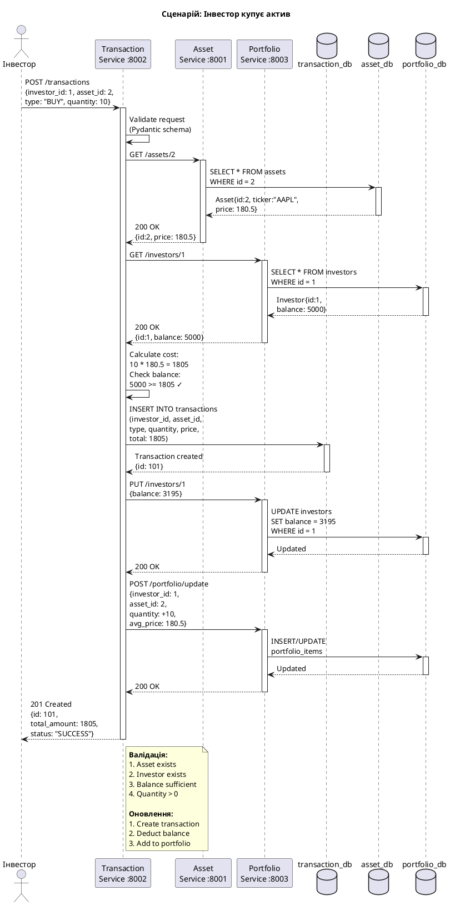
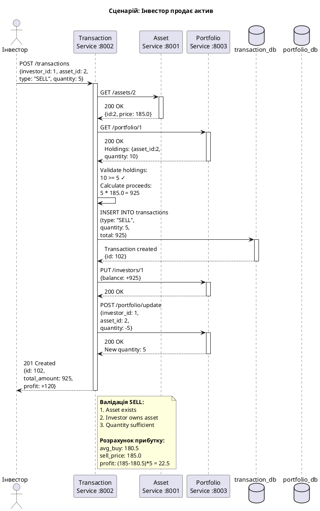
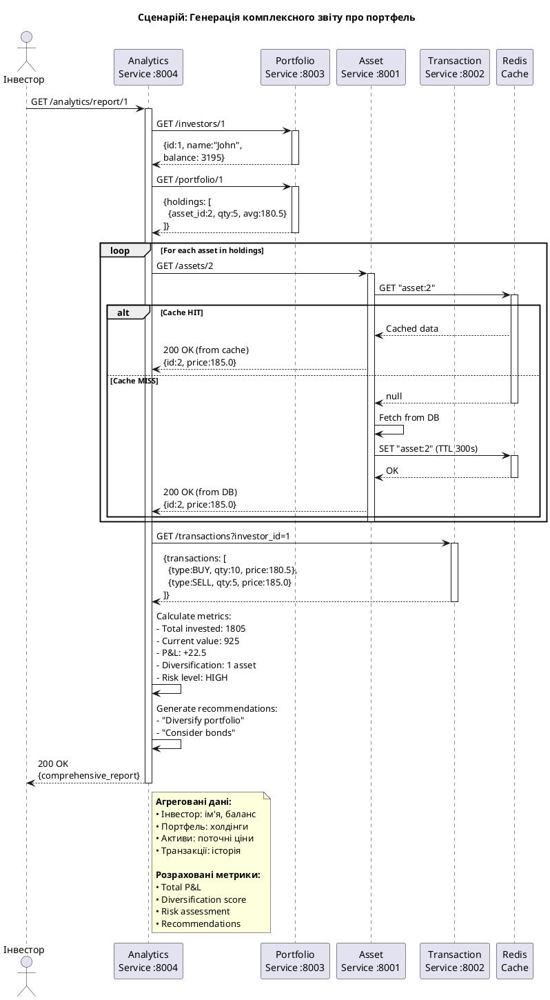
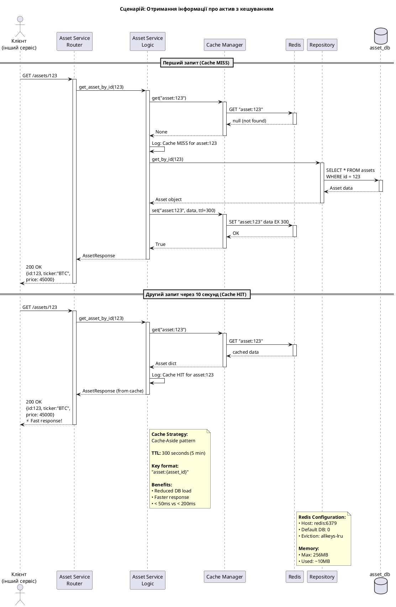
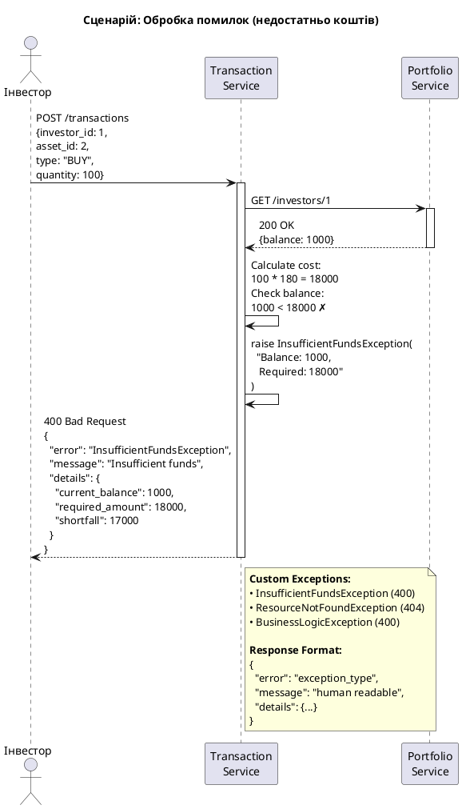
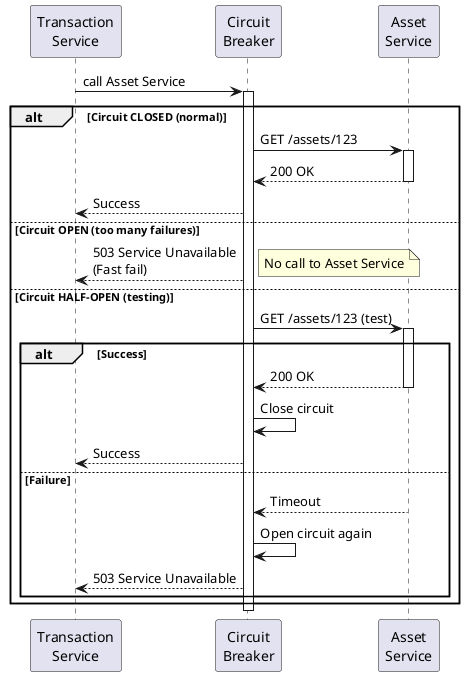

# Взаємодія між сервісами (Sequence Diagrams)

## PlantUML код

### Діаграма 1: Купівля активу (BUY Transaction)



### Діаграма 2: Продаж активу (SELL Transaction)



### Діаграма 3: Генерація аналітичного звіту



### Діаграма 4: Кешування в Asset Service



### Діаграма 5: Error Handling Flow



## Як використовувати

1. Скопіюйте код в [PlantUML Online Editor](https://www.plantuml.com/plantuml/uml/)
2. Або використайте VS Code + PlantUML extension
3. Створіть окремі файли: `buy-flow.puml`, `sell-flow.puml`, тощо
4. Експортуйте кожну діаграму окремо

## Опис сценаріїв

### 📈 BUY Transaction Flow

**Кроки:**
1. Валідація запиту (Pydantic)
2. Перевірка існування активу (Asset Service)
3. Перевірка балансу інвестора (Portfolio Service)
4. Розрахунок вартості покупки
5. Створення транзакції (Transaction DB)
6. Списання коштів з балансу (Portfolio Service)
7. Додавання активу до портфеля (Portfolio Service)
8. Повернення результату

**Часова складність:** ~200-300ms (4 HTTP запити)

### 📉 SELL Transaction Flow

**Кроки:**
1. Валідація запиту
2. Перевірка існування активу
3. Перевірка наявності активу в портфелі
4. Перевірка достатньої кількості для продажу
5. Створення транзакції SELL
6. Додавання коштів до балансу
7. Зменшення кількості активу в портфелі
8. Повернення результату з розрахунком прибутку

**Часова складність:** ~200-300ms

### 📊 Analytics Report Flow

**Кроки:**
1. Отримання даних інвестора (Portfolio Service)
2. Отримання портфельних позицій (Portfolio Service)
3. Отримання поточних цін активів (Asset Service) - може використовувати кеш
4. Отримання історії транзакцій (Transaction Service)
5. Розрахунок метрик (P&L, diversification, risk)
6. Генерація рекомендацій
7. Формування звіту

**Часова складність:** ~500-800ms (багато HTTP запитів)

### ⚡ Caching Flow

**Cache HIT:**
- Asset Service перевіряє Redis
- Знаходить дані
- Повертає з кешу
- **Швидкість: ~20-50ms**

**Cache MISS:**
- Asset Service перевіряє Redis
- Не знаходить дані
- Запитує PostgreSQL
- Зберігає в Redis (TTL 300s)
- Повертає дані
- **Швидкість: ~150-200ms**

### ❌ Error Handling

**Типові помилки:**
- 400 Bad Request: недостатньо коштів, недостатньо активів
- 404 Not Found: актив не знайдено, інвестор не знайдено
- 422 Unprocessable Entity: invalid input (Pydantic validation)
- 500 Internal Server Error: database connection, unexpected errors

## Communication Patterns

### Synchronous REST (поточна реалізація)

**Переваги:**
- ✅ Простота реалізації
- ✅ Легко дебажити
- ✅ Request-Response гарантована відповідь

**Недоліки:**
- ❌ Висока затримка (latency)
- ❌ Cascading failures
- ❌ Tight coupling

### Asynchronous Messaging (можлива альтернатива)

```
Transaction Service
    ↓ (publish event)
Message Queue (RabbitMQ/Kafka)
    ↓ (subscribe)
Portfolio Service (updates portfolio)
```

**Переваги:**
- ✅ Loose coupling
- ✅ Better scalability
- ✅ Fault tolerance

**Недоліки:**
- ❌ Складніша реалізація
- ❌ Eventual consistency
- ❌ Harder to debug

## Performance Metrics

### Без кешування
- GET /assets/{id}: ~150-200ms
- POST /transactions: ~300-400ms
- GET /analytics/report: ~800-1200ms

### З кешуванням (Redis)
- GET /assets/{id} (cache hit): ~20-50ms ⚡
- GET /assets/{id} (cache miss): ~150-200ms
- POST /transactions: ~250-350ms (швидші валідації)
- GET /analytics/report: ~400-600ms (швидші запити до assets)

### Покращення продуктивності
- Cache Hit Rate: 70-80% для popular assets
- Response Time Reduction: 60-75% для cached requests
- Database Load Reduction: 70-80%

## Circuit Breaker Pattern (рекомендація для production)



## Для звіту

Ці діаграми демонструють:
- ✅ Послідовність викликів між мікросервісами
- ✅ Синхронну HTTP комунікацію
- ✅ Валідацію бізнес-логіки
- ✅ Кешування через Redis
- ✅ Обробку помилок
- ✅ Розподілені транзакції (2PC альтернатива)
- ✅ Performance optimization
- ✅ Resilience patterns (circuit breaker)

## Часова складність операцій

| Операція | HTTP Calls | Avg Time | Cache Impact |
|----------|-----------|----------|--------------|
| Create Asset | 0 | 50ms | N/A |
| Get Asset | 0 | 150ms | -70% with cache |
| Create Investor | 0 | 50ms | N/A |
| BUY Transaction | 2-3 | 300ms | -20% with asset cache |
| SELL Transaction | 2-3 | 300ms | -20% with asset cache |
| Get Portfolio | 1-5 | 400ms | -50% with asset cache |
| Analytics Report | 5-15 | 800ms | -50% with cache |
