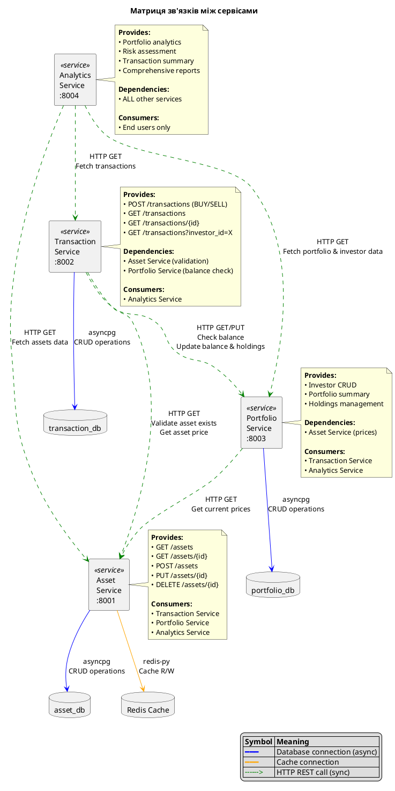
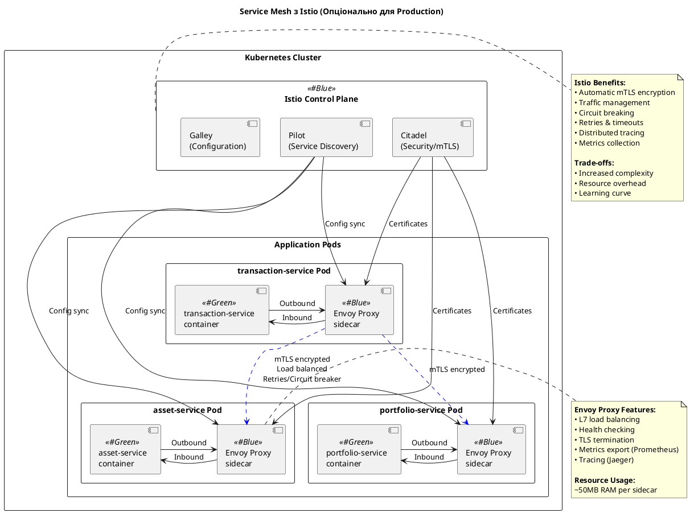
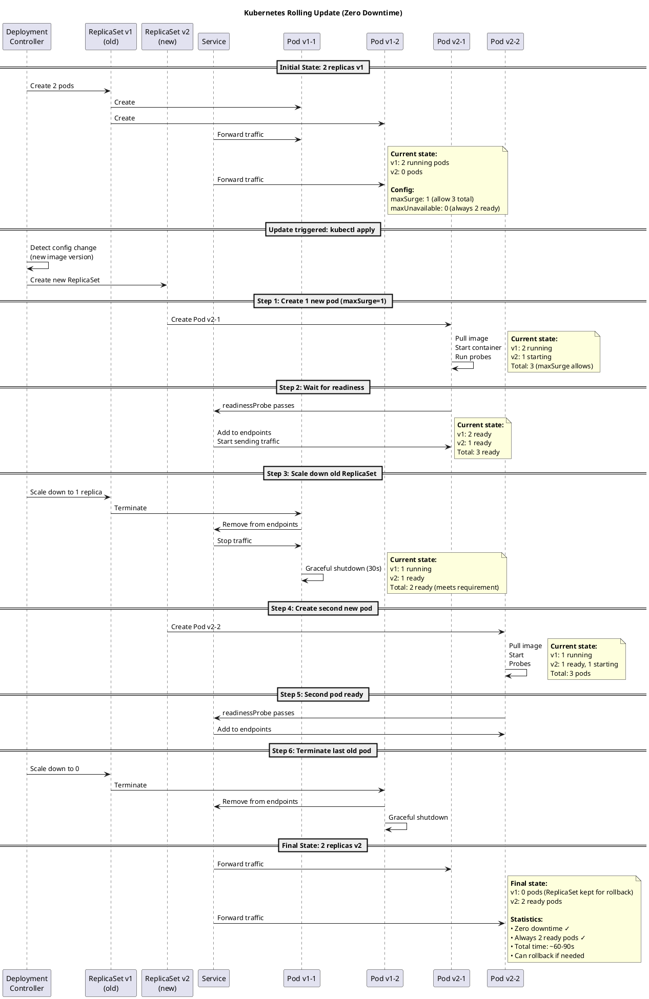

# Зв'язки між сервісами (Communication & Deployment)

## PlantUML код

### Діаграма 1: Service Communication Matrix



### Діаграма 2: Kubernetes Deployment Architecture

```plantuml
@startuml Kubernetes Deployment

!define KubernetesPuml https://raw.githubusercontent.com/dcasati/kubernetes-PlantUML/master/dist

skinparam rectangle {
    BackgroundColor<<node>> LightGray
    BackgroundColor<<pod>> LightBlue
    BackgroundColor<<service>> LightGreen
    BackgroundColor<<deployment>> LightYellow
    BorderColor Black
}

title Kubernetes Deployment Architecture

cloud "Kubernetes Cluster" {
    
    rectangle "Namespace: default" {
        
        ' Services (LoadBalancers/ClusterIP)
        rectangle "Kubernetes Services" as svc_layer <<service>> {
            component "asset-service\nClusterIP\n10.96.1.1:8001" as asset_svc
            component "transaction-service\nClusterIP\n10.96.1.2:8002" as tx_svc
            component "portfolio-service\nClusterIP\n10.96.1.3:8003" as portfolio_svc
            component "analytics-service\nClusterIP\n10.96.1.4:8004" as analytics_svc
            component "postgres-service\nClusterIP\n10.96.1.5:5432" as pg_svc
            component "redis-service\nClusterIP\n10.96.1.6:6379" as redis_svc
        }
        
        ' Deployments and Pods
        rectangle "Deployments & ReplicaSets" {
            
            rectangle "asset-service\nDeployment" as asset_deploy <<deployment>> {
                rectangle "Pod 1" as asset_pod1 <<pod>> {
                    component "asset-service\ncontainer" as asset_c1
                }
                rectangle "Pod 2" as asset_pod2 <<pod>> {
                    component "asset-service\ncontainer" as asset_c2
                }
            }
            
            rectangle "transaction-service\nDeployment" as tx_deploy <<deployment>> {
                rectangle "Pod 1" as tx_pod1 <<pod>> {
                    component "transaction-service\ncontainer" as tx_c1
                }
                rectangle "Pod 2" as tx_pod2 <<pod>> {
                    component "transaction-service\ncontainer" as tx_c2
                }
            }
            
            rectangle "portfolio-service\nDeployment" as portfolio_deploy <<deployment>> {
                rectangle "Pod 1" as portfolio_pod1 <<pod>> {
                    component "portfolio-service\ncontainer" as portfolio_c1
                }
                rectangle "Pod 2" as portfolio_pod2 <<pod>> {
                    component "portfolio-service\ncontainer" as portfolio_c2
                }
            }
            
            rectangle "analytics-service\nDeployment" as analytics_deploy <<deployment>> {
                rectangle "Pod 1" as analytics_pod1 <<pod>> {
                    component "analytics-service\ncontainer" as analytics_c1
                }
            }
            
            rectangle "postgres\nStatefulSet" as pg_deploy <<deployment>> {
                rectangle "Pod" as pg_pod <<pod>> {
                    component "postgres\ncontainer" as pg_c
                }
            }
            
            rectangle "redis\nDeployment" as redis_deploy <<deployment>> {
                rectangle "Pod" as redis_pod <<pod>> {
                    component "redis\ncontainer" as redis_c
                }
            }
        }
        
        ' ConfigMaps and Secrets
        rectangle "Configuration" {
            storage "ConfigMaps" as configmaps {
                file "asset-service-config"
                file "transaction-service-config"
                file "portfolio-service-config"
            }
            storage "Secrets" as secrets {
                file "postgres-credentials"
                file "redis-credentials"
            }
        }
        
        ' Persistent Storage
        rectangle "Storage" {
            database "PersistentVolume\npostgres-pv\n10Gi" as pv
            database "PersistentVolumeClaim\npostgres-pvc" as pvc
        }
    }
}

' Service to Pod mappings
asset_svc -down-> asset_pod1
asset_svc -down-> asset_pod2
tx_svc -down-> tx_pod1
tx_svc -down-> tx_pod2
portfolio_svc -down-> portfolio_pod1
portfolio_svc -down-> portfolio_pod2
analytics_svc -down-> analytics_pod1
pg_svc -down-> pg_pod
redis_svc -down-> redis_pod

' Pod to ConfigMap/Secret
asset_pod1 .up.> configmaps
tx_pod1 .up.> configmaps
portfolio_pod1 .up.> configmaps
pg_pod .up.> secrets

' Persistent storage
pg_pod -down-> pvc
pvc -down-> pv

' External access
actor "External User" as user
cloud "LoadBalancer\n(Optional)" as lb
user -down-> lb
lb -down-> asset_svc
lb -down-> tx_svc
lb -down-> portfolio_svc
lb -down-> analytics_svc

note right of asset_deploy
  **Replicas:** 2
  **Strategy:** RollingUpdate
  **Resources:**
  • requests: 100m CPU, 128Mi RAM
  • limits: 500m CPU, 256Mi RAM
  
  **Probes:**
  • livenessProbe: /health
  • readinessProbe: /health
  
  **Auto-scaling:** HPA (optional)
  • min: 2, max: 5 replicas
  • targetCPU: 70%
end note

note right of pg_deploy
  **Type:** StatefulSet
  **Replicas:** 1 (can be scaled)
  **Storage:** PVC 10Gi
  **Init Script:** ConfigMap mounted
  
  **Why StatefulSet:**
  • Stable network identity
  • Persistent storage
  • Ordered deployment
end note

note bottom of pv
  **Storage Class:** standard (hostPath)
  **Access Mode:** ReadWriteOnce
  **Reclaim Policy:** Retain
  
  **Production:**
  Use cloud provider storage:
  • AWS EBS
  • GCP Persistent Disk
  • Azure Disk
end note

@enduml
```



### Діаграма 3: Service Mesh Architecture (Advanced)



### Діаграма 4: Traffic Flow & Load Balancing

```plantuml
@startuml Traffic Flow

title Kubernetes Traffic Flow та Load Balancing

actor "User" as user

cloud "External LoadBalancer\n(Cloud Provider)" as external_lb {
    component "Elastic IP\n52.12.34.56" as public_ip
}

rectangle "Kubernetes Cluster" {
    
    component "Ingress Controller\n(NGINX/Traefik)" as ingress {
        component "Ingress Rules" as rules
    }
    
    rectangle "Services (ClusterIP)" {
        component "asset-service\n10.96.1.1:8001" as asset_svc
        component "portfolio-service\n10.96.1.3:8003" as portfolio_svc
    }
    
    rectangle "Pods" {
        component "asset-pod-1\n10.244.1.5" as asset_p1
        component "asset-pod-2\n10.244.2.8" as asset_p2
        component "asset-pod-3\n10.244.1.12" as asset_p3
        
        component "portfolio-pod-1\n10.244.2.3" as portfolio_p1
        component "portfolio-pod-2\n10.244.1.9" as portfolio_p2
    }
}

' Traffic flow
user -> public_ip : "HTTPS\napi.portfolio.com"
public_ip -> ingress : "HTTP\n:80 or :443"
ingress -> rules : "Route by path"

rules -> asset_svc : "/api/assets/*"
rules -> portfolio_svc : "/api/portfolio/*"

asset_svc -> asset_p1 : "Round-robin\n(healthy pods)"
asset_svc -> asset_p2
asset_svc -> asset_p3

portfolio_svc -> portfolio_p1
portfolio_svc -> portfolio_p2

note right of ingress
  **Ingress Rules:**
  ```yaml
  rules:
  - host: api.portfolio.com
    http:
      paths:
      - path: /api/assets
        backend:
          service:
            name: asset-service
            port: 8001
      - path: /api/portfolio
        backend:
          service:
            name: portfolio-service
            port: 8003
  ```
end note

note right of asset_svc
  **Service Type:** ClusterIP
  
  **Load Balancing Algorithm:**
  Round-robin (default)
  
  **Session Affinity:**
  None (stateless)
  
  **Endpoints:**
  Automatically updated by
  Kubernetes based on Pod
  readiness probes
end note

note right of asset_p1
  **Pod Selection:**
  Based on:
  • Health (readiness probe)
  • Current load
  • Zone locality (affinity)
  
  **Failed pod:**
  Automatically removed from
  Service endpoints
end note

@enduml
```



### Діаграма 5: Dependency Graph

```plantuml
@startuml Dependency Graph

title Граф залежностей сервісів та інфраструктури

digraph dependencies {
    rankdir=TB;
    node [shape=box, style=filled];
    
    // Infrastructure
    postgres [label="PostgreSQL\nStatefulSet", fillcolor=lightblue];
    redis [label="Redis\nDeployment", fillcolor=lightyellow];
    
    // Services
    asset [label="Asset Service\n2 replicas", fillcolor=lightgreen];
    transaction [label="Transaction Service\n2 replicas", fillcolor=lightgreen];
    portfolio [label="Portfolio Service\n2 replicas", fillcolor=lightgreen];
    analytics [label="Analytics Service\n1 replica", fillcolor=lightgreen];
    
    // Configuration
    config [label="ConfigMaps", fillcolor=lightgray];
    secrets [label="Secrets", fillcolor=pink];
    
    // Dependencies
    postgres -> config [label="reads"];
    postgres -> secrets [label="reads"];
    
    asset -> postgres [label="asset_db"];
    asset -> redis [label="cache"];
    asset -> config [label="reads"];
    
    transaction -> postgres [label="transaction_db"];
    transaction -> asset [label="HTTP"];
    transaction -> portfolio [label="HTTP"];
    transaction -> config [label="reads"];
    
    portfolio -> postgres [label="portfolio_db"];
    portfolio -> asset [label="HTTP"];
    portfolio -> config [label="reads"];
    
    analytics -> asset [label="HTTP"];
    analytics -> transaction [label="HTTP"];
    analytics -> portfolio [label="HTTP"];
    analytics -> config [label="reads"];
    
    // Critical path
    {rank=same; postgres; redis;}
    {rank=same; asset; transaction; portfolio;}
    {rank=same; analytics;}
}

note bottom
  **Deployment Order:**
  1. ConfigMaps, Secrets
  2. PostgreSQL, Redis (StatefulSet/Deployment)
  3. Asset Service (depends on postgres, redis)
  4. Transaction & Portfolio Services (depend on postgres, asset)
  5. Analytics Service (depends on all other services)
  
  **Critical Dependencies:**
  • If postgres is down → All services fail
  • If asset-service is down → Transaction & Portfolio limited
  • If redis is down → Asset Service slower (no cache)
  • If analytics is down → Only reporting affected
end note

@enduml
```

### Діаграма 6: Rolling Update Strategy



## Kubernetes Manifest Files Пояснення

### asset-service-deployment.yaml

```yaml
apiVersion: apps/v1
kind: Deployment
metadata:
  name: asset-service
  labels:
    app: asset-service
    tier: backend
spec:
  replicas: 2                    # Start with 2 pods
  strategy:
    type: RollingUpdate          # Update strategy
    rollingUpdate:
      maxSurge: 1                # Max 1 extra pod (total 3)
      maxUnavailable: 0          # Always keep 2 ready
  selector:
    matchLabels:
      app: asset-service
  template:
    metadata:
      labels:
        app: asset-service
        version: v1
    spec:
      containers:
      - name: asset-service
        image: asset-service:latest
        imagePullPolicy: Never   
        ports:
        - containerPort: 8001
          name: http
        env:
        - name: DATABASE_URL
          valueFrom:
            configMapKeyRef:
              name: asset-service-config
              key: database_url
        - name: REDIS_URL
          valueFrom:
            configMapKeyRef:
              name: asset-service-config
              key: redis_url
        resources:
          requests:              # Minimum guaranteed
            memory: "128Mi"
            cpu: "100m"
          limits:                # Maximum allowed
            memory: "256Mi"
            cpu: "500m"
        livenessProbe:           # Is container alive?
          httpGet:
            path: /health
            port: 8001
          initialDelaySeconds: 15
          periodSeconds: 10
          timeoutSeconds: 5
          failureThreshold: 3
        readinessProbe:          # Is container ready to serve?
          httpGet:
            path: /health
            port: 8001
          initialDelaySeconds: 10
          periodSeconds: 5
          successThreshold: 1
          failureThreshold: 3
---
apiVersion: v1
kind: Service
metadata:
  name: asset-service
spec:
  type: ClusterIP              # Internal-only (or LoadBalancer for external)
  selector:
    app: asset-service
  ports:
  - protocol: TCP
    port: 8001                 # Service port
    targetPort: 8001           # Container port
    name: http
```

## Для звіту

Ці діаграми демонструють:
- ✅ Матрицю communication між сервісами
- ✅ Kubernetes deployment architecture
- ✅ Service discovery та load balancing
- ✅ Rolling update strategy (zero downtime)
- ✅ Resource management (requests/limits)
- ✅ Health checks (liveness/readiness probes)
- ✅ ConfigMaps і Secrets для конфігурації
- ✅ Persistent storage для бази даних
- ✅ Service mesh (опціонально для advanced setup)
- ✅ Traffic flow через Ingress
- ✅ Dependency graph

## Comparison: Docker Compose vs Kubernetes

| Аспект | Docker Compose | Kubernetes |
|--------|----------------|------------|
| Призначення | Local development | Production deployment |
| Масштабування | Manual | Automatic (HPA) |
| High Availability | No | Yes (multi-node) |
| Load Balancing | Basic | Advanced (Service) |
| Rolling Updates | No | Yes |
| Self-healing | Restart only | Replace pods |
| Service Discovery | DNS | DNS + Labels |
| Configuration | .env files | ConfigMaps/Secrets |
| Storage | Volumes | PersistentVolumes |
| Networking | Bridge | Advanced (CNI) |
| Complexity | Low | High |
| Use case | Development | Production |
