# 🚀 PlantUML - Швидкий старт (5 хвилин)

## Найпростіший спосіб (без встановлення)

### Крок 1: Відкрийте онлайн редактор

Перейдіть на: **https://www.plantuml.com/plantuml/uml/**

### Крок 2: Скопіюйте тестовий код

Вставте цей код в редактор:

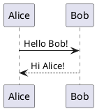

### Крок 3: Натисніть "Submit"

Ви побачите просту sequence діаграму! 🎉

### Крок 4: Спробуйте діаграму з нашого проекту

1. Відкрийте [01-class-diagram.md](01-class-diagram.md)
2. Скопіюйте код між \`\`\`plantuml та \`\`\`
3. Вставте в онлайн редактор
4. Натисніть Submit
5. Збережіть як PNG: правою кнопкою → Save Image As

**Готово! Ви створили свою першу діаграму!**

---

## Для VS Code (більш зручно)

### Встановлення (один раз)

#### 1. Встановіть Java

**Windows (через Chocolatey):**
```powershell
# Відкрийте PowerShell як адміністратор
choco install openjdk11
```

**Або вручну:**
- Завантажте: https://www.java.com/download/
- Встановіть
- Перезавантажте комп'ютер

**Перевірка:**
```powershell
java -version
```

Повинно показати: `java version "11.x.x"` або новіше

#### 2. Встановіть Graphviz (опціонально, для складних діаграм)

```powershell
choco install graphviz
```

Або завантажте: https://graphviz.org/download/

#### 3. Встановіть PlantUML Extension в VS Code

1. Відкрийте VS Code
2. Натисніть `Ctrl+Shift+X` (Extensions)
3. Шукайте "PlantUML"
4. Встановіть розширення від **jebbs**
5. Натисніть "Reload" або перезапустіть VS Code

### Використання в VS Code

#### Створити діаграму:

1. Створіть файл `test.puml`
2. Вставте PlantUML код
3. Натисніть `Alt+D` для preview
4. Або `F1` → "PlantUML: Preview Current Diagram"

#### Експорт діаграми:

1. Правою кнопкою в preview → Export
2. Або `F1` → "PlantUML: Export Current Diagram"
3. Виберіть формат:
   - PNG (для Word/PDF)
   - SVG (векторна графіка, масштабується)
   - PDF (для документів)

---

## 📝 Швидкий довідник PlantUML

### Базовий синтаксис

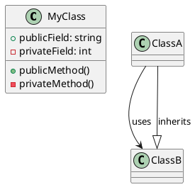

### Sequence diagram

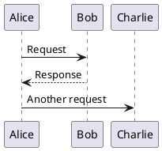

### Component diagram

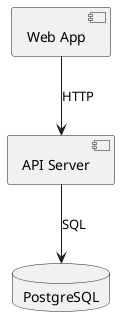

### ER Diagram

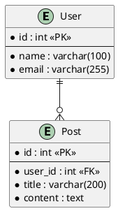

---

## 🎨 Кольори та стилі

### Змінити колір компонента

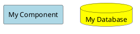

### Використати skinparam

```plantuml
@startuml
skinparam componentBackgroundColor LightGreen
skinparam componentBorderColor Black
skinparam arrowColor Red

component "Service A"
component "Service B"
"Service A" --> "Service B"
@enduml
```

### Типи стрілок

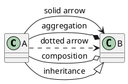

---

## 💡 Корисні поради

### 1. Автоматичне компонування

PlantUML сам розставляє елементи. Але можна підказати:

```plantuml
@startuml
left to right direction
' або
top to bottom direction
@enduml
```

### 2. Групування

```plantuml
@startuml
package "My Package" {
  class A
  class B
}

rectangle "My Group" {
  component C
  component D
}
@enduml
```

### 3. Нотатки

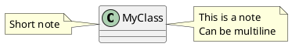

### 4. Приховати деталі

```plantuml
@startuml
class MyClass {
  ' Показати тільки назву
}

hide empty members
hide circle
@enduml
```

---

## 🐛 Troubleshooting

### Проблема: "Cannot find Java"

**Рішення:**
```powershell
# Перевірте Java
java -version

# Якщо не знайдено - встановіть
choco install openjdk11

# Або додайте в PATH
$env:PATH += ";C:\Program Files\Java\jdk-11\bin"
```

### Проблема: "Graphviz not found"

**Рішення:**
```powershell
# Встановіть Graphviz
choco install graphviz

# Додайте в PATH
$env:PATH += ";C:\Program Files\Graphviz\bin"
```

### Проблема: Preview не працює в VS Code

**Рішення:**
1. Перевірте що PlantUML extension встановлено
2. Restart VS Code
3. Перевірте Output panel: View → Output → PlantUML
4. Переконайтеся що файл має розширення `.puml` або `.plantuml`

### Проблема: Діаграма занадто велика

**Рішення:**
```plantuml
@startuml
' Зменшити масштаб
scale 0.7

' Або змінити DPI
skinparam dpi 100
@enduml
```

---

## 📚 Шпаргалка PlantUML

### Діаграми класів

```plantuml
class A {
  +public
  -private
  #protected
  ~package
  {static} staticField
  {abstract} abstractMethod()
}

A --|> B : extends
A --* B : composition
A --o B : aggregation
A --> B : association
A ..> B : dependency
A ..|> B : implements
```

### Sequence діаграми

```plantuml
A -> B : synchronous call
A ->> B : asynchronous call
A --> B : return
A -\ B : call with arrow only
activate A
deactivate A
```

### Component діаграми

```plantuml
component C1
component [C2]
component "Long Name" as C3

C1 --> C2
C2 ..> C3 : uses
```

### Deployment діаграми

```plantuml
node "Server 1" {
  [Component A]
}

node "Server 2" {
  [Component B]
}

database "DB" {
}

[Component A] --> [Component B]
[Component B] --> [DB]
```

---

## 🎯 Практика з нашим проектом

### Завдання 1: Проста class diagram

Створіть файл `simple-class.puml`:

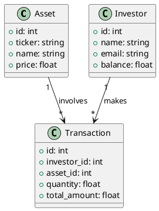

Перегляньте: `Alt+D`

### Завдання 2: Проста sequence diagram

Створіть файл `simple-sequence.puml`:

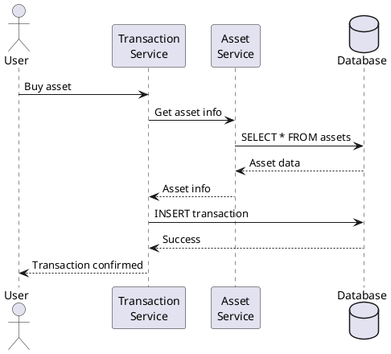

### Завдання 3: Змініть кольори

Додайте на початок:

```plantuml
skinparam sequenceArrowColor DarkBlue
skinparam participantBackgroundColor LightGreen
skinparam participantBorderColor Black
```

---

## 🎓 Наступні кроки

1. ✅ Спробуйте онлайн редактор (5 хв)
2. ✅ Встановіть VS Code extension (10 хв)
3. ✅ Створіть просту діаграму (5 хв)
4. ✅ Відкрийте наші діаграми з `diagrams/` (10 хв)
5. ✅ Експортуйте в PNG для звіту (5 хв)

**Загальний час: 35 хвилин від нуля до готових діаграм!**

---

## 📖 Додаткові ресурси

### Офіційна документація
- [PlantUML Guide](https://plantuml.com/guide) - повний довідник
- [Real World PlantUML](https://real-world-plantuml.com/) - приклади з реальних проектів
- [PlantUML Cheat Sheet](https://ogom.github.io/draw_uml/plantuml/) - шпаргалка

### Відео туторіали
- [PlantUML in 5 Minutes](https://www.youtube.com/results?search_query=plantuml+tutorial) - YouTube
- [PlantUML Crash Course](https://www.youtube.com/results?search_query=plantuml+crash+course)

### Інтерактивні приклади
- [PlantUML Web Server](https://www.plantuml.com/plantuml/uml/)
- [PlantText](https://www.planttext.com/)

---

## 🎉 Вітаємо!

Тепер ви знаєте достатньо для створення всіх діаграм для вашого звіту!

**Подальша допомога:**
- Всі наші діаграми: [diagrams/](../diagrams/)
- Детальний індекс: [DIAGRAMS_INDEX.md](DIAGRAMS_INDEX.md)
- Візуальні альтернативи: [VISUAL_DIAGRAMS_GUIDE.md](VISUAL_DIAGRAMS_GUIDE.md)

**Успіхів! 🚀**
